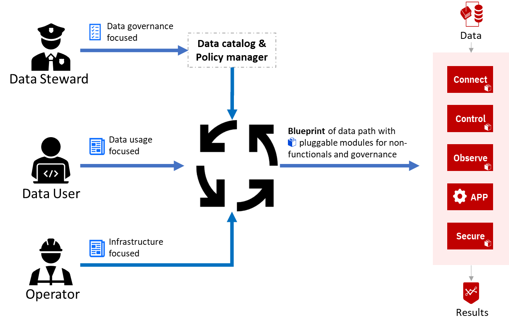

# Introduction

Fybrik is a cloud native platform to unify data access and governance, enabling business agility while securing enterprise data. By providing access and use of data only via the platform, Fybrik brings together access and governance for data, greatly reducing risk of data loss. 

Fybrik allows:

* **Data users** to use data in a self-service model without manual processes, without needing to confer with data stewards, and without dealing with credentials. Use common tools and frameworks for reading from and exporting data to data lakes or data warehouses.
* **Data stewards** to control data usage by applications. Use the organization's _policy manager_ and _data catalog_ of choice and let Fybrik automatically enforce data governance policies, whether they be based on laws, industry standards or enterprise policies.
* **Data operators** to automate data lifecycle mangement removing the need for manual processes and custom jobs created by data operators, providing them with [config policies](.config-policies.md) to optimize the data flows orchestrated by fybrik.

## How does it work?

The inputs to Fybrik are declarative definitions with separation of aspects:

- Data stewards input definitions related to data governance and security
- Data users input definitions related to data usage in the business logic of their applications
- Data operators input definitions related to infrastructure and available resources

Upon creation or change of any definition, Fybrik compiles together relevant inputs into a plotter describing the flow of data between the application and the data sources/destinations (data plane). 
The plotter augments the application workload and data sources with additional services and functions packed as pluggable modules. This creates a data path that:

- Integrates business logic with non-functional data centric requirements such as enabling data access regardless of its physical location, caching, lineage tracking, etc.
- Enforces governance relating to the data and its lifecycle; including limiting what data the business logic can access, performing transformations as needed, controlling what the business logic can export and to where
- Makes data available in locations where it is needed. Thus in a multi cluster scenario it may copy data from one location to another, something known as an implicit copy.  The implicit copy is deleted when no longer needed.

Fybrik is an open solution that can be extended to work with a wide range of tools and data stores. For example, the injectable [modules](./modules.md) and the [connectors](./connectors.md) to external systems (e.g., to a data catalog) can all be third party.

The logic used by fybrik to generate the data planes is customizable.  An organization can determine how best its infrastructure should be leverage via [config policies](./config-policies.md)

## Applications

Fybrik considers applications as first level entities. Before running a workload, an application needs to be registred to a Fybrik control plane by applying a `FybrikApplication` resource. This is the declarative definition provided by the data user. The registration provides context about the application such as the purpose for which it's running, the data assets that it accesses, and a selector to identify the workload. Additional context such as geo-location is extracted from the platform. 

The actions taken by Fybrik are based on policies and the context of the application. Specifically, Fybrik does not consider end-users of an application. It is the responsibility of the application to implement mechanisms such as end user authentication if required, e.g. using Istio [authorization with JWT](https://istio.io/docs/tasks/security/authorization/authz-jwt/).

There are specific situations in which there is no workload associated with a `FybrikApplication` resource.  Examples of these are requests to ingest data into a governed environment, or (future) requests to clean up data in the governed environment based on data governance policies.

## Security

While Fybrik handles enforcement of data governance policies, if one could access the data not through the platform then we lose control over data usage.

For this reason, Fybrik does not let user applications ever observe data access credentials, both for externally created data assets nor for data assets created by the Fybrik control plane and applications running in it.

Instead, modules run in the data path to handle access to data, including passing the data access credentials to upstream data stores. Security is preserved by authorizing the applications based on their Pod identities.

## Multicluster
Fybrik supports data paths that access data stores that are external to the cluster such as cloud managed object stores or databases as well as data stores within the cluster such as databases running in Kubernetes. All applications and modules however will run within a cluster that has Fybrik installed.

Multi-cloud and hybrid cloud scenarios are supported out of the box by running Fybrik in multiple Kubernetes clusters and configuring the manager to use a multi cluster coordination mechanism such as razee. This enables cases such as running, for example, transformations on-prem while creating an implicit copy of an on-prem SoR table to a public cloud storage system.

