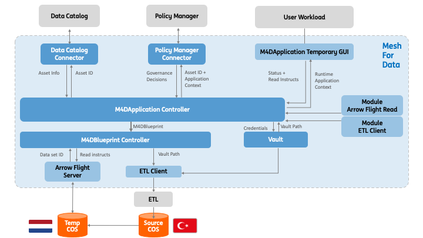

The project currently has two extension mechanisms, namely connectors and modules. 
This page describes what modules are and how they are leveraged by the control plane to build the data plane flow.  

As described in the [Architecture](/docs/overview/architecture/) page, the control plane generates a description of a data plane based on policies and application requirements. This is known as a blueprint, and includes components that are deployed by the control plane to fulfill different data-centric requirements.  For example, a component that can mask data can be used to enforce a data masking policy, or a component that copies data may be used to create a local data copy to meet performace requirements, etc. Modules are the way to describe such data plane components and make them available to the control plane. 

The functionality described by the module may be deployed (a) per workload, or (b) it may be a component that runs independent of the workload and its associated control plane.  In the case of (a), the Mesh for Data control plane handles the deployment of the functional component. In the case of (b) where the functionality of the module runs independently and handles requests from multiple workloads, a client module is what is deployed by the Mesh for Data control plane.  This client module passes parameters to the external component and monitors that status and results of the request to the external component.  The external component is declared as a dependency in the module yaml.

In both cases, the module component is packaged as a [Helm](https://helm.sh/) chart that the control plane can install to a workload's data plane. To make a module available to the control plane it must be registered by applying a [`M4DModule`](/docs/reference/api/generated/app/#k8s-api-github-com-ibm-the-mesh-for-data-manager-apis-app-v1alpha1-m4dmodule) CRD.

The following diagram shows an example with an Arrow Flight module that is fully deployed by the control plane and a second module where the client is deployed by the control plane but the ETL component providing the functionality has been independently deployed and supports multiple workloads.

# Components that make up a module
There are several parts to a module:
1. [Module Workload](#module-workload): the workload that runs once the Helm chart is installed by the control plane
2. (Optional) External component: deployed and managed independently of the Mesh for Data.  In this case, the [Module Workload](#module-workload) is a client to the external component.
3. [Module Helm Chart](#module-helm-chart): the package containing the module workload that the control plane installs as part of a data plane.
4. [M4DModule YAML](#m4dmodule): describes the functional capabilities, supported interfaces, and has links to the Module Helm chart - that is either the functional component itself or the client to an external component

# When is a module used?

There are three main data flows in which modules may be used:
* Read - preparing data to be read and/or actually reading the data
* Write - writing a new data set or appending data to an existing data set
* Copy - for performing an implicit data copy on behalf of the application.  The decision to do an implicit copy is made by the control plane, typically for performance or governance reasons.

A module may be used in one or more of these flows, as is indicated in the module's yaml file.

# Credential management
Modules that access or write data need to receive from the control plane either the credentials to the data stores  or a link to where those credentials reside.  Modules thus can indicate which approach they will use:
* secret-provider - module calls the Mesh for Data secret provider to obtain the credentials.  TODO: Add link to API
* automatic - credentials are injected by data-mesh, meaning that the credential values are sent as parameters to the module when the module is called.  

TODO: It appears that the code currently assumes all modules call the secret provider directly

# Control Plane Choice of Modules
A user workload description (M4DApplicaton) includes a list of the data sets required, the technologies that will be used to read them, and information about the location and reason for the use of the data.  This information together with input from data and enterprise policies, determine which modules are chosen by the control plane. Currently the logic for choosing the modules for the data plane is as follows:

(1) If the user is requesting to read data, find all the read flow related modules

(2) If the data set protocol/format and the protocol/format requested by the user do not match, then make an implicit copy of the data, storing it such that it is readable via the protocol/format requested by the user.

(3) If the governance action(s) required on the data set are not supported by the read module, and it is supported by the implicit copy module ... then make an implicit copy. Otherwise no need for implicit copy, and read will be done from the source directly.

TODO: Update to address multi-cluster logic

# Available Modules

The table below lists the currently available modules: 
Name | Description | M4DModule 
---  | ---         | ---      
[arrow-flight-module](https:///the-mesh-for-data-flight-module) | reading datasets while performing data transformations | https://raw.githubusercontent.com/IBM/the-mesh-for-data-flight-module/master/module.yaml<!-- implicit-copy-module is not listed because it's still only available as part of the project tests -->

# Contributing
For details of the components that make up a module, and how to create one please see -  [`Contribute a Module`](/contribute/module/)
